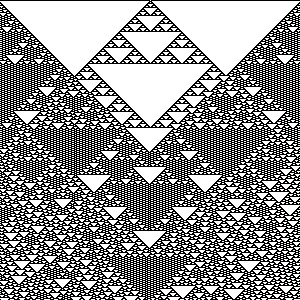
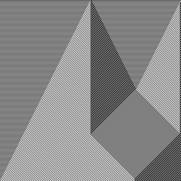
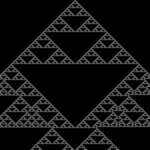
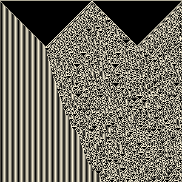
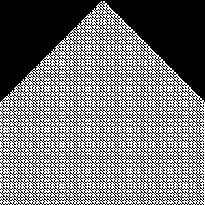

# pdn-one-dimensional-cellular-automata-plugin
A Paint.NET plugin I built to render any ruleset of one-dimensional cellular automata (0 - 255).

Built using the Paint.NET framework in C#.

<h1>How to install:</h1>

1.  Download the zip file, extract the files, and execute the batch file Install_oneDautomata.bat.

2.  If you see a success ascii text, then you have successfully installed the plugin.  Nice.

3.  Upon opening Paint.NET after a successful installation, choose Effects, Render, oneDautomata.

Play around with different values and starting positions (up to 3).  This amazing mathematical phenomenon generates some stunning visuals at times.

---------------------------------

<h1>Source Code:</h1>

**oneDautomata.cs** contains all of the C# source code written for this plugin, located in this repository's base directory.

--------------------------------

<h2 align="center">
  Below are some rendering examples from what can be achieved with this plugin.  Try layering different rulesets to see what you can render!  Some pretty wild designs will reveal themselves from this algorithm.
</h2>

  

<h1 align="center">Ruleset 129</h1>
  

  

<h1 align="center">Ruleset 99</h1>

  

<h1 align="center">Ruleset 26</h1>

  

<h1 align="center">Ruleset 135</h1>

  

<h1 align="center">Ruleset 214</h1>

  

<h1 align="center">Multilayered Ruleset 99 with background gradient</h1>

